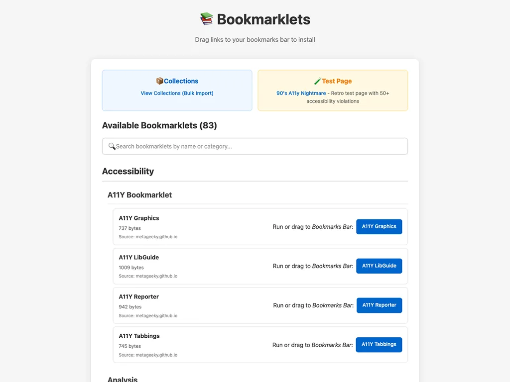

# Bookmarklet Manager

A collection of accessibility and utility bookmarklets, built from ES6+ source files with a minification and build pipeline.

## Quick Start

```bash
# Install dependencies
npm install

# Build all bookmarklets
npm run build

# Serve locally for testing
npm run serve
```

Then open <http://127.0.0.1:8080> in your browser.

## Screenshot



## Installation

1. Show your bookmarks bar (`Ctrl/Cmd + Shift + B`)
2. Click any "Run" button to test the bookmarklet on the current page
3. Drag the button to your bookmarks bar to install it permanently
4. Navigate to any website and click the bookmarklet to run it

## Creating New Bookmarklets

```bash
# Create a new bookmarklet from template
npm run new my-bookmarklet

# Edit the source file
# Edit src/my-bookmarklet.js

# Rebuild
npm run build
```

## Bookmarklet Template

```javascript
(function () {
 'use strict';

 try {
  // ===== YOUR CODE HERE =====
  alert('Hello from bookmarklet!');

  // ===== END YOUR CODE =====
 } catch (err) {
  alert('Bookmarklet Error: ' + err.message);
 }
})();
void 0;
```

## Requirements

| Rule | Requirement |
|------|-------------|
| **IIFE** | Wrap in `(function(){ 'use strict'; ... })();` |
| **No Navigation** | End with `void 0;` |
| **Self-contained** | No external runtime dependencies (CDN only if needed) |
| **Security** | Use `createElement` over `innerHTML`; Shadow DOM for UI |
| **Z-index** | Use `999999+` for injected elements |
| **Attribution** | Include source URL and author in header comments |

## Collections

All bookmarklets can be installed one by one or with the bulk import approach.

An [overview with descriptions](dist/bookmarklets.md) is available. 

## Categories

### Accessibility

- **A11Y Tools** - Graphics, LibGuide, Reporter, Tabbings
- **Color & Contrast** - Color contrast checking tools
- **Focus & Interactive** - Focus management and testing
- **Screen Readers** - Screen reader helpers (JAWS, NVDA, VoiceOver)
- **Images** - Image accessibility testing
- **Spacing** - Text spacing and target size testing (WCAG)
- **Structure & Headings** - Document structure, headings, landmarks, and ARIA roles
- **Syntax Check** - HTML/CSS validation
- **Third Party** - External tools
- **URLs & Links** - Link checking and analysis
- **WAI-ARIA** - ARIA testing tools

### Other

- **CSS** - CSS analysis and manipulation
- **Developer** - Performance and script inspection
- **Markdown** - Markdown conversion tools
- **Network** - Network utilities
- **Validation** - Form and page validation
- **Visual** - Visual testing aids

## Build Pipeline

1. **Minify**: `terser` (JS), `html-minifier-terser` (HTML), `lightningcss` (CSS)
2. **Prefix**: Add `javascript:`
3. **Encode**: URI encode special characters

## Scripts

| Command | Description |
|---------|-------------|
| `npm run build` | Build all bookmarklets to `dist/` |
| `npm run new <name>` | Create new bookmarklet from template |
| `npm run copy <name>` | Copy bookmarklet URL to clipboard |
| `npm run serve` | Start HTTP server for testing |

## Project Structure

```
public-bookmarklets/
├── src/                    # Source files
│   ├── Accessibility/      # Accessibility bookmarklets
│   │   ├── A11Y Tools/
│   │   ├── Color & Contrast/
│   │   ├── Focus & Interactive/
│   │   ├── Screen Readers/
│   │   │   ├── JAWS/
│   │   │   ├── NVDA/
│   │   │   └── VoiceOver/
│   │   ├── Images/
│   │   ├── Spacing/
│   │   ├── Structure & Headings/
│   │   ├── Syntax Check/
│   │   ├── Third Party/
│   │   ├── URLs & Links/
│   │   └── WAI-ARIA/
│   ├── Other/              # Non-accessibility utilities
│   │   ├── CSS/
│   │   ├── Developer/
│   │   ├── Markdown/
│   │   ├── Network/
│   │   ├── Validation/
│   │   └── Visual/
│   └── _private/           # Private bookmarklets (not built)
├── dist/                   # Built output (mirrors src structure)
│   ├── accessibility/
│   ├── other/
│   └── index.html          # Main index page
├── scripts/
│   ├── build.js            # Build script
│   ├── new.js              # New bookmarklet template
│   └── copy.js             # Copy to clipboard
├── package.json
├── .gitignore
└── README.md
```

## Contributing

Contributions are welcome! Please ensure:

1. Source attribution is included in header comments
2. Code follows the bookmarklet requirements above
3. Bookmarklets are tested before submitting
4. Private/copyrighted code goes in `src/_private/`

## License

MIT unless otherwise noted in individual file headers.

## Legal & Licensing

### Main License

This project is primarily licensed under the **MIT License** - see [LICENSE](LICENSE) for details.

### Multiple Licenses

This repository contains code under multiple licenses:

| License | Bookmarklets |
|---------|--------------|
| **MIT** | Most bookmarklets, including JAWS Helper, NVDA Helper |
| **MPL-2.0** | A11Y Graphics, A11Y LibGuide, A11Y Reporter, A11Y Tabbings |
| Various | See individual file headers |

### Third-Party Content

All bookmarklets include attribution to their original authors in source file headers.
See [THIRD-PARTY-NOTICES.md](THIRD-PARTY-NOTICES.md) for detailed attributions.

## Credits

- **WebAIM** - Contrast Checker
- **Various sources** - See individual file headers
